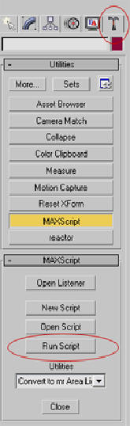
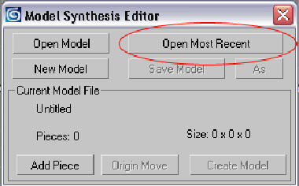
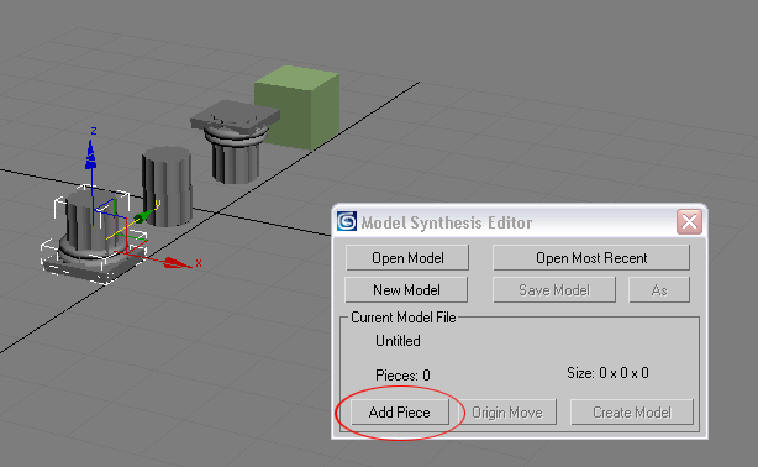
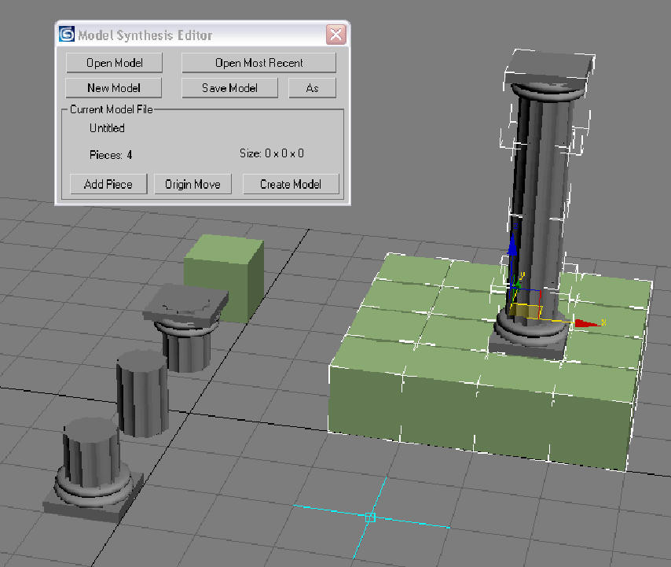
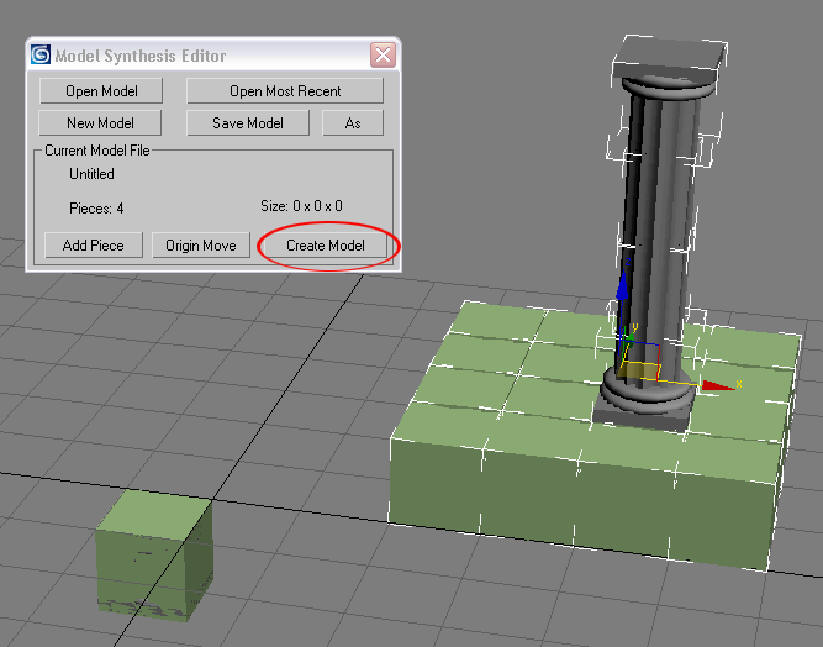

# Displaying and Editing Models in 3DS Max

## Generating and Displaying

Set the input parameters for the model in "samples.xml". Use a *tiledmodel*. Build and run the main file "Model Synthesis.cpp".
In [3DS Max](https://www.autodesk.com/products/3ds-max/overview), open the correct model file in "models/3DS Max Scenes".
* Click on the Utilities Icon
* Click on “MAXScript”
* Click “Run Script”
* Open the script file “outputs/editor.ms”

* Click "Open Model" or "Open Most Recent"

* If asked if you want to open up a new 3D Studio file, click “Yes”.
* Wait a minute.  Large models may take some time to load.
* The model will appear.
* If you want to generate a larger model, increase the size of the model in samples.xml.
* Before you generate a second model you should clear out the old model, otherwise they probably will interfere with each other.  Click “New Model” to remove the old model.

## Creating Your Own Example Model

There are two parts to creating an example model.  First, you need to create a set of model pieces.
Model pieces are the building blocks of a model.  The second is to arrange the building blocks in a
3D grid to form models.  The figure below demonstrates how a model of a pillar can be constructed
using four distinct model pieces. Every position in a 3D lattice is assigned an integer value
corresponding to the model piece that occupies the space. In this case, there are four different model
pieces numbered 0 through 3.

To create a model piece: 

* Create the objects you want in the model piece using 3D Studio.

* Run the “editor.ms” script as explained above.

* Select the objects in a model piece and click “Add Model Piece”.

* Model pieces should fit inside a 10 x 10 x 10 cube.  Before creating the model piece you should scale your objects to fit inside the cube.

The objects in the model pieces are now grouped together as a single unit.  The next step is to arrange the model pieces in space in a 3D grid.

* Create several model pieces.

* Copy and paste the model pieces into a 3D grid.  Only put copies of the original model pieces into a grid.  The original pieces should be kept separately.

* The model pieces should be arranged exactly 10 units apart from each other and from the original model pieces.  Activate the Snaps Toggle  in 3D Studio and snap to the grid points to move in exact 10-unit increments.  You may want to open up a few example models to see how the model pieces should be arranged. 

Snaps Toggle: 

* All of the original model pieces should be grouped together near the origin.  In the picture below, all the model pieces are together inside of the green box. 

* To get the model pieces to the origin.  Click "Origin Move".  It will attempt to automatically move all the model pieces to the origin. The model pieces are not always placed correctly and may need to be fixed by hand.

* Select all of the model pieces that you arranged together in a 3D grid.

* Click “Create Model”.

* Click “Save Model” to save your example model.

* Now you can synthesize models from this example using the Model Synthesis Algorithm.

## Modifying in Blocks

There are two ways to do model synthesis.  You could generate the entire model all at once or you could gradually modify a model in small parts or blocks. 
To modify in blocks, the algorithm first creates an initial model that is empty or contains only a ground plane.
Then it modifies the initial model. It attempts to find a tileable ground plane. You will get a warning message if it cannot find one. For example, the city model has no tileable ground plane.

Modifying the model in blocks is slower, but it is necessary to create some of the large models.  For some large models, model synthesis is always successful.
For example, the canyon model always succeeds, but sometimes model synthesis fails and tries again.  Large blocks are more difficult than small blocks.
If the block size is too large, model synthesis may be fail repeatedly, but if the block size is too small the generated model may be less interesting. 
A block size of 10 x 10 x 10 is a reasonable value to start with.

To modifying in blocks, add the attribute *blockWidth="10"* and *blockLength="10"* to your sample in "samples.xml".
