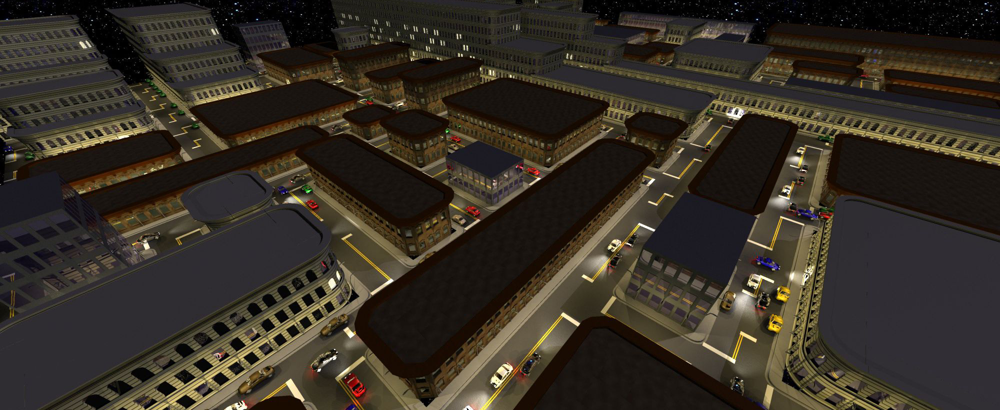
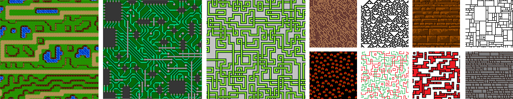
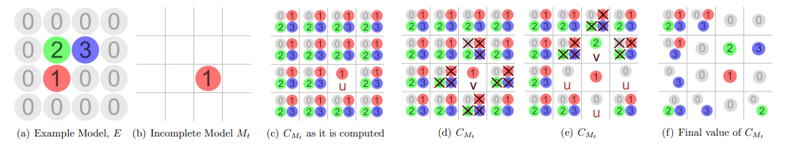
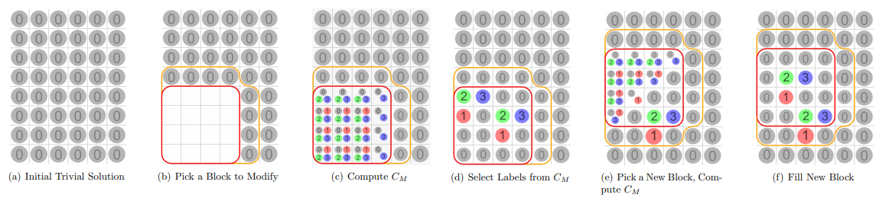

# Model Synthesis

Model synthesis is a technique for generating 2D and 3D shapes from examples. It is inspired by texture synthesis.
Model synthesis was created by Paul Merrell. Merrell published several papers about it from 2007 - 2011 at
[i3D](https://paulmerrell.org/wp-content/uploads/2021/06/model_synthesis.pdf),
[SIGGRAPH Asia](https://paulmerrell.org/wp-content/uploads/2021/06/continuous.pdf),
[TVCG](https://paulmerrell.org/wp-content/uploads/2021/06/tvcg.pdf), and
in his [PhD disseration](https://paulmerrell.org/wp-content/uploads/2021/06/thesis.pdf).
More information can be [found on his website](https://paulmerrell.org/model-synthesis/). It contains additional
results and videos explaining the algorithm. This code implements Merrell's [2007 algorithm](https://paulmerrell.org/wp-content/uploads/2021/06/model_synthesis.pdf).

## Related Work

Model synthesis was inspired by work on texture synthesis, especially [Efros and Leung, 1999](https://people.eecs.berkeley.edu/~efros/research/EfrosLeung.html).
A comparison to other texture synthesis algorithms can be found in [Section 2.2.2 here](https://paulmerrell.org/wp-content/uploads/2021/06/thesis.pdf).

Model synthesis is formulated as a constraint satisfication problem. To solve this, model synthesis originally
used the AC-3 algorithm by [Mackworth [1977]](https://www.cs.ubc.ca/~mack/Publications/AI77.pdf). But the AC-4 method by 
[Mohr and Henderson [1986]](http://www.cs.utah.edu/~tch/CS4300/resources/AC4.pdf) is faster. Both methods are included
in this project. (Flip the Boolean "useAc4" to switch between them.) Model synthesis was the first to use this type of approach for
texture synthesis and procedural modeling. Model synthesis initially focused on procedural modeling with only a few texture synthesis examples.

[Wave Function Collapse](https://github.com/mxgmn/WaveFunctionCollapse) (WFC) by Gumin [2016] also generates textures and models
by solving a constraint satisfication problem. WFC follows the algorithm below, but chooses the cells in a different order in Step 2.
Gumin focused more on texture synthesis. He created more example textures (which are used in this project). And he developed the idea of
applying this to overlapping image tiles. This is often more convenient since the tiles can be computed directly from an image.
[Here is a more detailed comparison of the two methods](https://paulmerrell.org/wp-content/uploads/2021/07/comparison.pdf).

## How to Use

Build and run the main file "Model Synthesis.cpp". The list of inputs and the input parameters are in "samples.xml".
The example images and models are in the *samples* directory. Results are saved into *outputs*. There are three types of
inputs: simpletiled, overlapping, and tiledmodel. The first two generate image files. The tiledmodel generates a text file
which can be used to create a 3D model in [3DS Max](https://www.autodesk.com/products/3ds-max/overview) or [Blender](https://www.blender.org/).
To load it in 3DS Max, first open the model file in "models/3DS Max Scenes". Then run the MaxScript file "editor.ms",
click "Open Model" and select the generated text file. [This file](3DS_Max_Editor.md) contains more information on
how to use editor.ms. To load in Blender, open the model file in "models/Blender Scenes" then run "load-synth.py".

## Algorithm Overview

The goal is to generate new images or models that look like an example. The example is divided into 2D or 3D tiles.
Two tiles can be next to one another in the output if they were next to each other in the example. This is called
*the adjacency constraint*. Our goal is to fill in a grid with tiles. Each grid cell contains a label. Each
label represents one of the tiles. The assigned labels must satisfy the adjacency constraint. This is a constraint
satisfaction problem. To solve it, we keep track of a list of possible labels that can be assigned to each
cell.

1. Assign every possible label to each cell.
2. For each cell, pick one of the possible labels. Assign it to the output.
	1. Remove the other labels from the cell.
	2. Each time a label is removed propagate this removal to the other cells.
	Eliminate any labels that do not satisfy the adjacency constraint. This part uses the AC-4 algorithm.

#### Modifying in Blocks

This algorithm can fail. During the propagation step, it is possible for every label to be removed from every cell.
This is, in fact, an NP-hard problem. What this means is that the difficulty of the problem grows exponentially with the size of the output.
The algorithm is likely to succeed as long as the output size is kept small. Furthermore, large textures and models can be
generated incrementally. We can start with a trivial solution and modify it in small parts. This allows us to reliably
generate large textures and models.

This is just a brief overview. More details can be found in the [videos here](https://paulmerrell.org/model-synthesis/)
or in [Section 3 here]((https://paulmerrell.org/wp-content/uploads/2021/06/thesis.pdf)).

## Credits

Most of the code in this project was written by Paul Merrell with a few exceptions:
1. The XML parser by [Frank Vanden Berghen](http://www.applied-mathematics.net/tools/xmlParser.html),
2. The PNG reading and writing by [Lode Vandevenne](https://lodev.org/lodepng/)
3. The importer for Blender (load-synth.py) by Jason Sewall.

The 3D models were created by Paul Merrell.

The images and tile sets are the same as Gumin's [Wave Function Collapse](https://github.com/mxgmn/WaveFunctionCollapse).
The tile sets are in a format he constructed. He writes "
Some samples are taken from the games Ultima IV and [Dungeon Crawl Stone Soup](https://github.com/crawl/crawl). Circles
tileset is taken from [Mario Klingemann](https://twitter.com/quasimondo/status/778196128957403136). FloorPlan tileset is
taken from [Lingdong Huang](https://github.com/LingDong-/ndwfc). Idea of generating integrated circuits was suggested to
me by [Moonasaur](https://twitter.com/Moonasaur/status/759890746350731264) and their style was taken from Zachtronics'
[Ruckingenur II](http://www.zachtronics.com/ruckingenur-ii/). Cat overlapping sample is taken from the Nyan Cat video,
Qud sample was made by Brian Bucklew, MagicOffice + Spirals samples - by rid5x, ColoredCity + Link + Link 2 + Mazelike + 
RedDot + SmileCity samples - by Arvi Teikari, Wall sample - by Arcaniax, NotKnot + Sand + Wrinkles samples - by Krystian
Samp. Summer tileset was made by Hermann Hillmann. Voxel models were rendered in [MagicaVoxel](http://ephtracy.github.io/)."

## References

A. Efros and T. Leung. [Texture synthesis by non-parametric sampling](https://people.eecs.berkeley.edu/~efros/research/EfrosLeung.html). ICCV, 1999.

M. Gumin. 2016. [WaveFunctionCollapse](https://github.com/mxgmn/WaveFunctionCollapse). GitHub repository, 2016.

A. Mackworth. [Consistency in networks of relations](https://www.cs.ubc.ca/~mack/Publications/AI77.pdf). Artificial Intelligence, 1977.

P. Merrell. [Model Synthesis](https://paulmerrell.org/wp-content/uploads/2021/06/thesis.pdf). Ph.D. Dissertation, University of North Carolina at Chapel Hill, 2009.

P. Merrell and D. Manocha. [Model Synthesis: A General Procedural Modeling Algorithm](https://paulmerrell.org/wp-content/uploads/2021/06/tvcg.pdf). IEEE Transactions on Visualization and Computer Graphics, 2010.

P. Merrell and D. Manocha. [Continuous Model Synthesis](https://paulmerrell.org/wp-content/uploads/2021/06/continuous.pdf). ACM Transactions on Graphics, 2008.

P. Merrell. [Example-Based Model Synthesis](https://paulmerrell.org/wp-content/uploads/2021/06/model_synthesis.pdf). Symposium on Interactive 3D Graphics (i3D), 2007.

R. Mohr and T. Henderson. [Arc and path consistency revisited. Artificial Intelligence](http://cse.unl.edu/~choueiry/Documents/Mohr+Henderson-AIJ1986.pdf), 1986.

